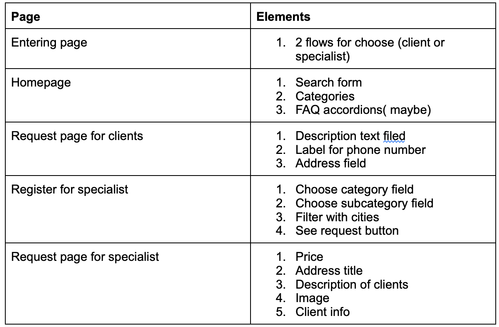

# CSS 410 Research tools and methods
## Team members
Aituar Konys (180103045) - Product Manager, Business Analytic
Abylbek Khassenov (180103060) - Ios Developer
Laila Mukhambetzhanova (180103267) - UI/UX designer
Azamat Meirkhan (180103170) - Ios Developer
## Project
Our project is about to get chance for individuals to gain a help from a specialist for payment. Having map the costumer will choose needed specialist and the app will find the closest specialist around so they can connect.
## Alternatives / Market research
-Naimi.kz 
-shaqyr.kz
## Goals
Our main goal is to help to our citizens and connect them together. Currently we know that in out big country there is many good specialists that may have no work or cannot connect with people in real life, moreover lets not forget about the injuries that our citizens get doing work that is made for specialist. That is the reason we made ups with this idea in our project and our goal is to solve this problem and create something in the process of New Kazakhstan.
## Technologies
In our project we use Excel, Microsoft services, Trello, Figma, Adobe Illustrator, Swift, UiKit

## Pages / Activities 
We will have following pages:
- Register page
- List of services
- Main page with all categories
- Personal page
- Settings page

## User Personas
Our app targets on any user person as we understand that specialist can be anyone and the one who need them also. Main target to help and focus may be old generation from 45 and more , as they are the ones who may need help in physical actions or etc.
## User stories
As a 50 years old women I want to fix the broken door in my house , and I need it as soon as possible.
As a 25 years old man I want to set up my new computer , but I don’t understand any of this.
## Sitemap, Page descriptions

## Non-Functional requirements
The application must be built in Swift
- The application must be hosted in App Store
- The application must available for newest iOS versions
- The application must be able to support 200 users

## Risks
Our application will not be able to enter the market
Our application may die in competition because lack of resources
## Mockups, Wireframes

## Future iterations
Our world is being in process, everyday we see something new , new jobs , new gadgets , new technology. Its not that easy to follow all the trends for everyone, especially to our old gen , that is why this app will gain more importance as time goes.