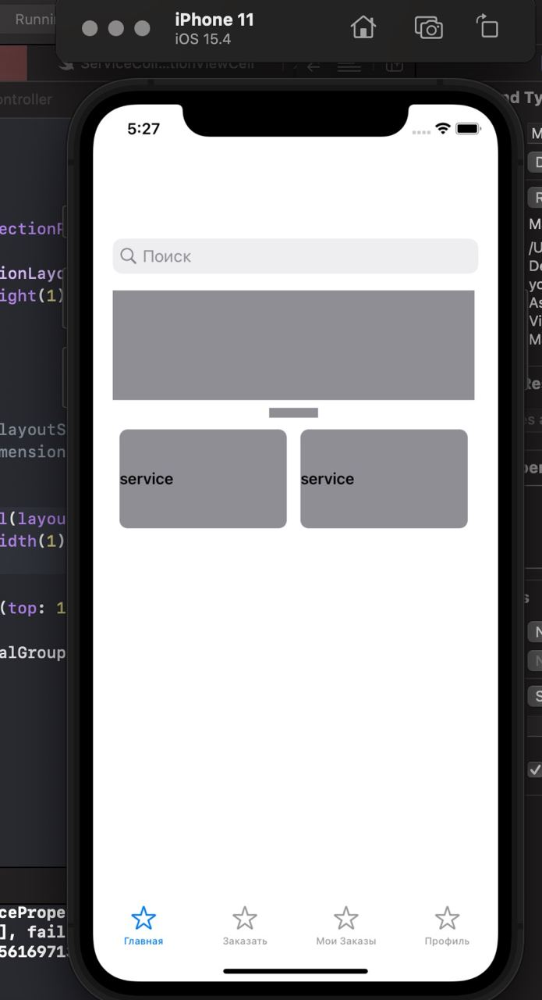
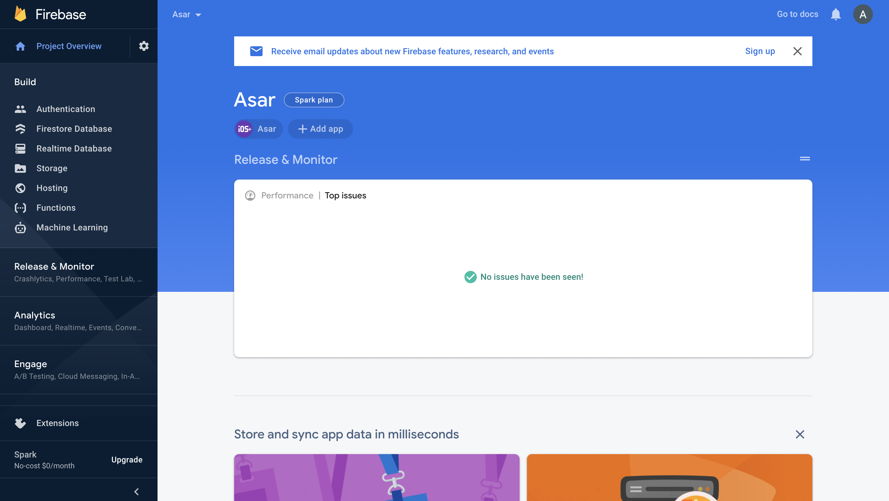
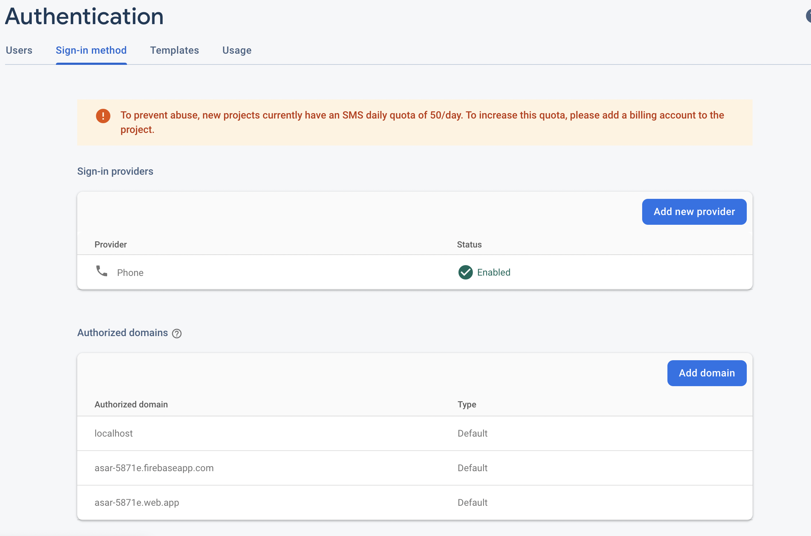
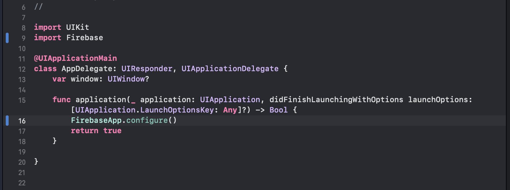
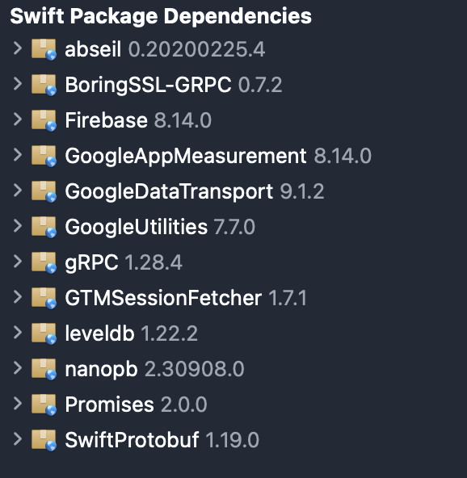
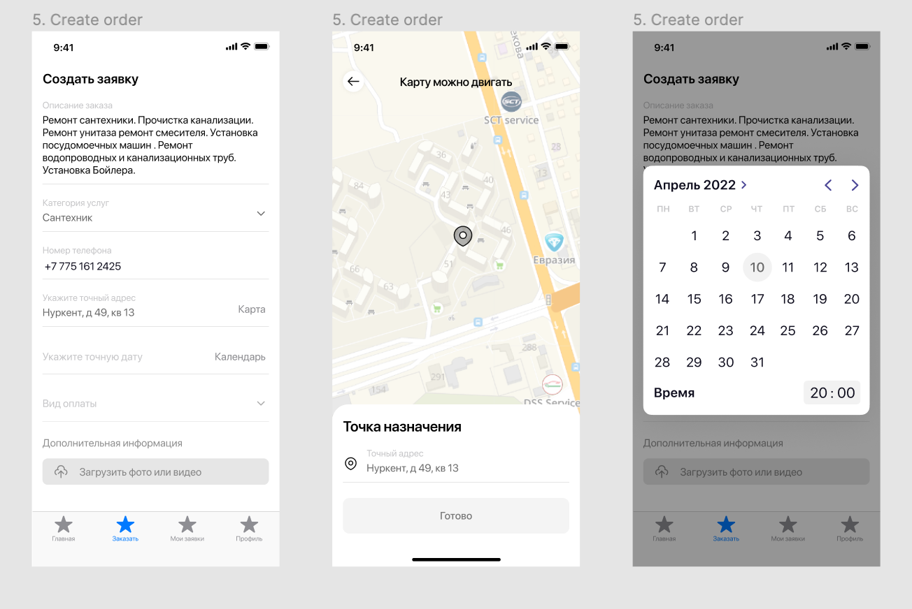
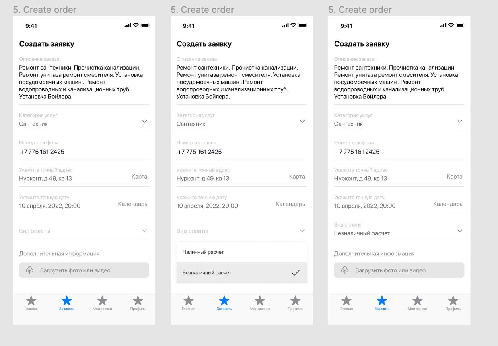
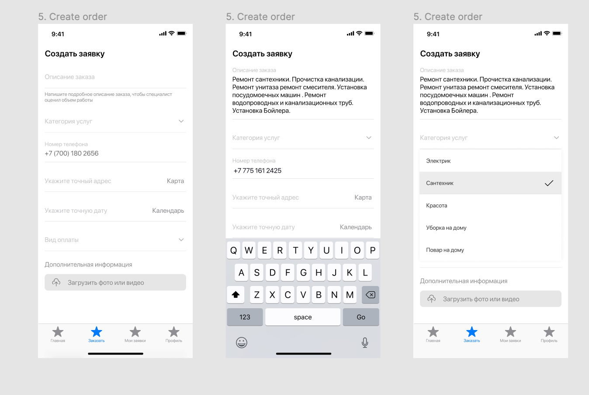
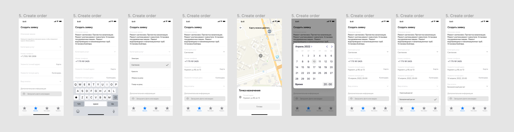
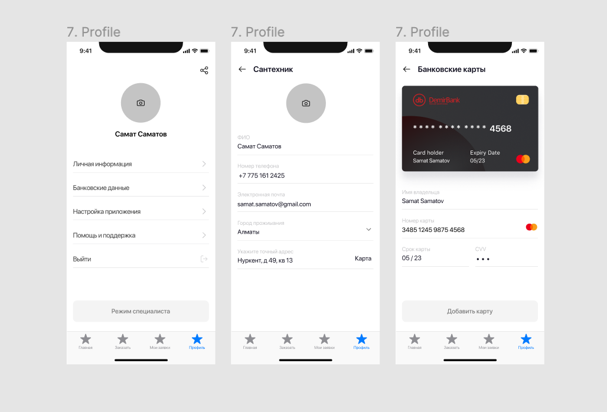

# Nurpeiis Bexultan

Keep making the view controllers by given UX design. Wrote it by given code
    * class TabBarViewController: UITabBarController {

    override func viewDidLoad() {
        super.viewDidLoad()
        
        let vc1 = UINavigationController(rootViewController: MainViewController())
        let vc2 = UINavigationController(rootViewController: OrderViewController())
        let vc3 = UINavigationController(rootViewController: MyOrdersViewController())
        let vc4 = UINavigationController(rootViewController: ProfileViewController())
        
        
        
        vc1.tabBarItem = UITabBarItem(title: "Главная", image: UIImage(systemName: "star"), tag:1)
        vc2.tabBarItem = UITabBarItem(title: "Заказать", image: UIImage(systemName: "star"), tag:1)
        vc3.tabBarItem = UITabBarItem(title: "Мои Заказы", image: UIImage(systemName: "star"), tag:1)
        vc4.tabBarItem = UITabBarItem(title: "Профиль", image: UIImage(systemName: "star"), tag:1)
        
        
        setViewControllers([vc1, vc2, vc3, vc4], animated: false)

    }
    
}
    * class MainViewController:
    let search: UISearchController = {}()
    let scrollView = UIScrollView()
    let pageControl: UIPageControl = {}()
    let collectionView: UICollectionView = UICollectionView()

# Khassenov Abylbek

Creating a project in firebase and linking them to the xcode project for further work.

First of all, we are going to use firebase to authenticate the user through a phone number. To do this, enable this option in firebase and further expand it through mail, etc.

firebase settings in xcode environment

# Konys Aituar
https://docs.google.com/forms/d/e/1FAIpQLSfOWz5Qx_7uXVCWG5jBa1e8mKWVDIiGt01VvbI2O_CKobC1FA/viewform?usp=sf_link
Ended the survey for potential specialist to work. Still continue on studying more about data analyst , this week was more about thinking as DA and practical works.

Moreover this week I started on analysing the market for potential advertisment places and target that we are searching for. Target was mostly chosen older generation as they are ones who need help in some home problems , research on what is most sites the use and what target can be made is in progress.

# Laila Mukhambetzhanova

