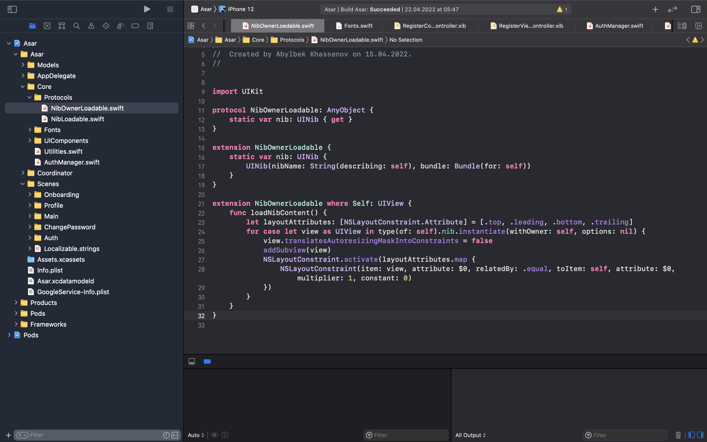
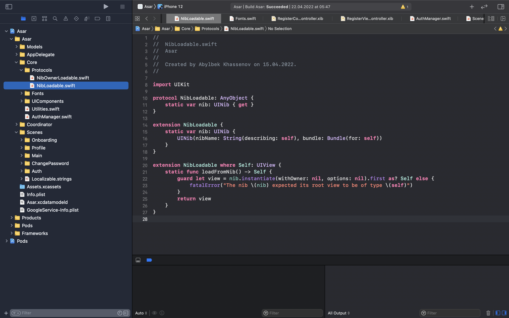
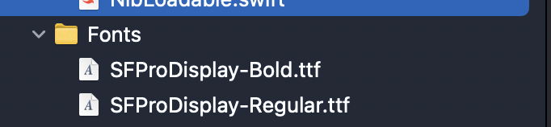
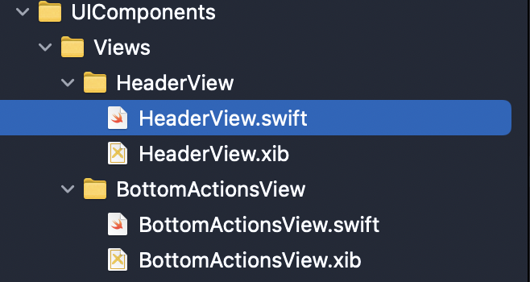
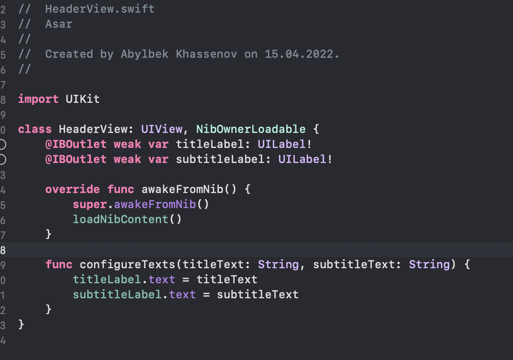
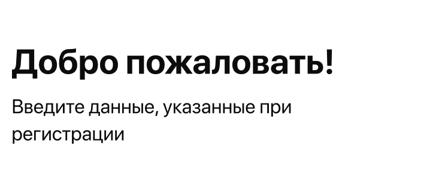

# Laila Mukhambetzhanova

# Konys Aituar
Continue searching of specialist market and giving them the version of google form made in last week, and asking for their feedback on adding or deleting questions. Needing on more requests to make analys pool

# Nurpeiis Bexultan

Input Firebase to our app. Install all the needed cocoapods for it.

# Khassenov Abylbek

Add two files nibOwnerLoadable and nibownerloadable that helps to load xib files

Add fonts from design on figma 

Add header view that will use more than one page 

# Meirkhan Azamat
Providing some tasks for team members. Prepared to improve my presentation skills for the future.
https://www.googleadservices.com/pagead/aclk?sa=L&ai=DChcSEwjI54zl6a33AhXKAKIDHZJRDpMYABAAGgJsZQ&ae=2&ohost=www.google.com&cid=CAESauD2XcM7DornK87ChPda1_ZLEfuGaL_Nau-_rQLqT2Mo0ZeEHBLsBnaPqqK2D3WArsMTlQYv09rvV_7rIM2lnY3TLM_AMlSGq1wxRBdun7M62oCxLgrvs4kdKFTfgkc7J9Nv5EkHXaUfjvc&sig=AOD64_3Twi1J0JEQF9qSIIaPacj6ElDp4w&q&adurl&ved=2ahUKEwjxrIXl6a33AhWGjYsKHeO8DgEQ0Qx6BAgEEAE&dct=1
