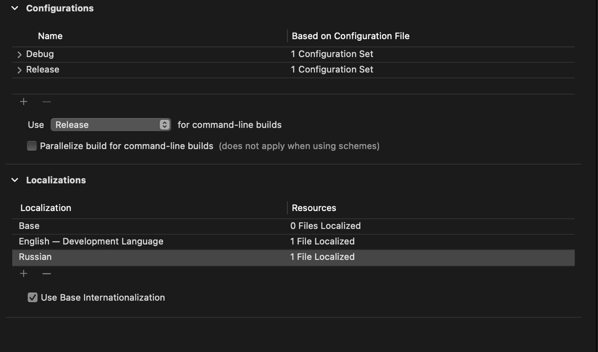
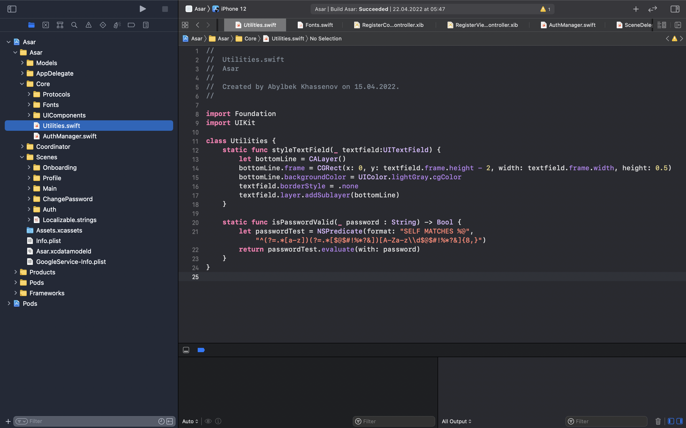
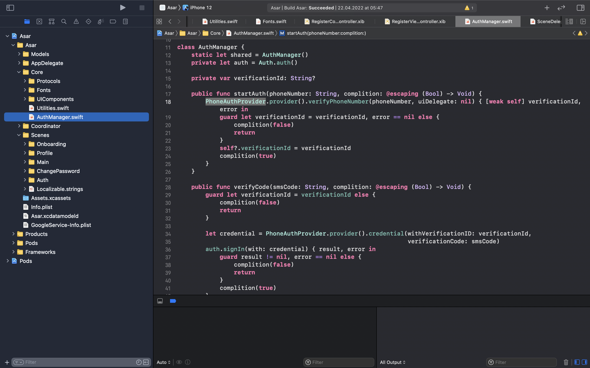

# Aituar Konys
Had an meeting with Leila on detailing the logistic of booking specialist in our app, by overlooking many options choose the most comfortable one and got on developing process. After that had call with Azamat to end up the logical part and end flow in Miro.Also editted form for specialist and serving them to make an analysis

# Nurpeiis Bexultan

Localized our app to two languages. One of the base system language english and the second russian.

# Khassenov Abylbek 

Add Utilities class that will consist some functions to help avoid overriding some code and to structure code style

Add auth manager that have two functions veryPhoneNumber and signIn with FireBase

# Meirkhan Azamat
Organized meeting with Aituar to checked some parts of logic, after i made changes on our specialist flow in Miro. And i searched feedbacks of our competiter on their official website https://naimi.kz and https://2gis.kz/almaty/firm/70000001039963081.
