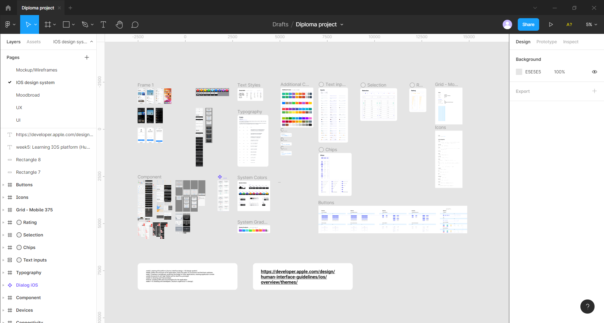
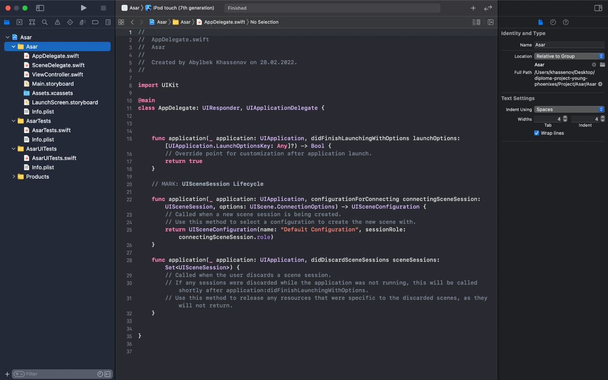

# Laila Mukhambetzhanova
* Learned IOS platform
* by the following link https://developer.apple.com/design/human-interface-guidelines/ios/overview/themes/

# Azamat Meirkhan
* Researched marketplace (First i downloaded alternative applications like naimi.kz and shaqyr. And i found the one disadvantages of them in payment system, a lot of people complained that they can not pay by online. I noted to me to avoid this problem in the future)
* Created Trello platform for out team https://trello.com/b/l1k8Zhnf/tasks
# Aituar Konys
* Look up for the trand beeing around our sphere
* Downloaded and tried to find worst positions in alternative apps not to have same problems(review of comments about the apps also made)

# Khassenov Abylbek
Create a project with a software integrated development environment (IDE) for macOS, iOS, watchOS, and tvOS platforms. The name of the project is Asar (Ancient Kazakh custom "asar" translated into Russian means "with the whole world." The main goal of this tradition is to help others) since the basis of our project is to help people who need it.

Choice of architecture:
Which architectures can we choose : MVC, MVVM, VIPER

Why not MVC - the dependence of files on each other, as a result of which it will be more difficult to test and change the project, it will be more difficult, also our MODEL VIEW CONTROLLER turns into a Massive View Controller, which means that the view controller contains all the logic and all the data, which also makes it difficult work .

Why not VIPER - because both developers have no development experience, which promises incorrect use of the architecture itself.

Why we chose MVVM - there is development experience and convenient file changeability and independence of different layers from each other.

# Nurpeiis Bexultan

Choose an architectures for Asar project. There were a lot of architectures, that we can use, but we took MVVM. Because it has a great two points than other architectures:
    *Speed test
    *Easy to control
