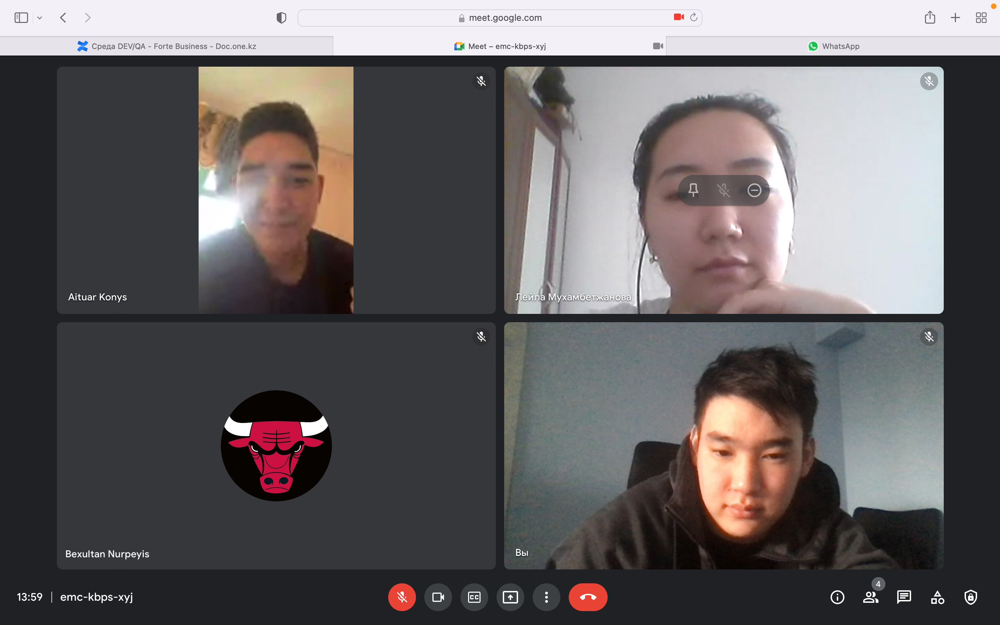
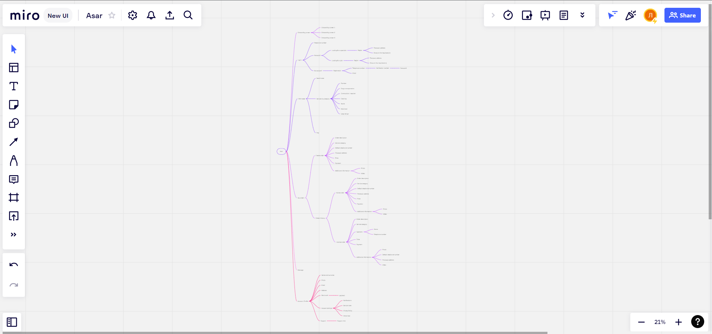
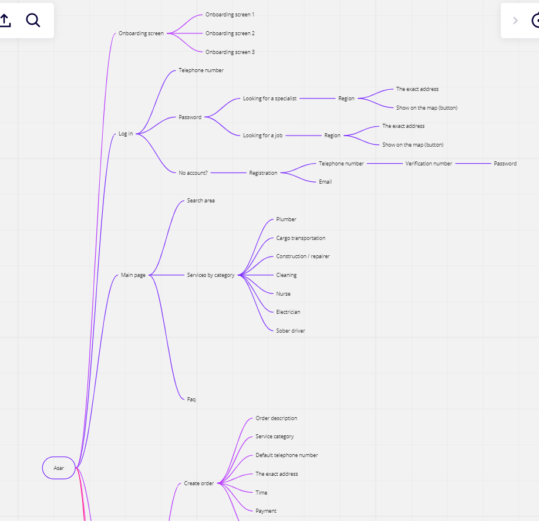
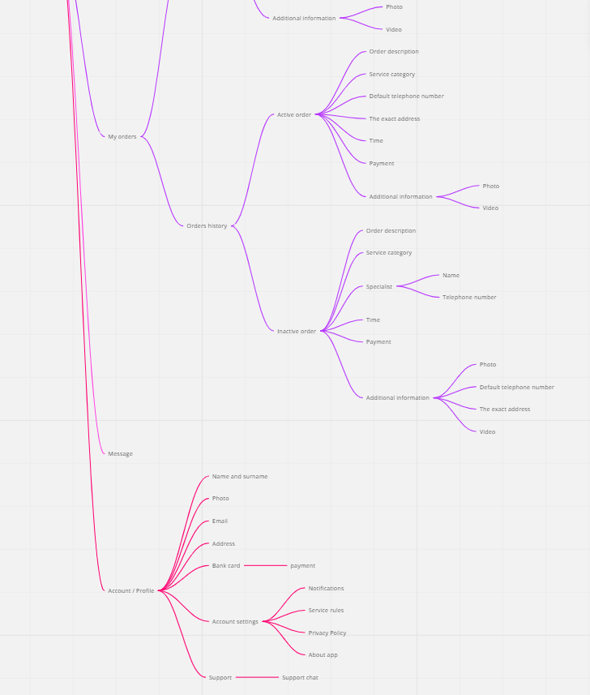
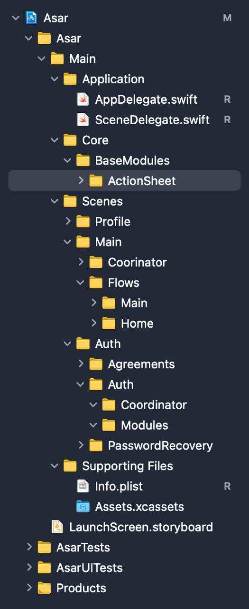
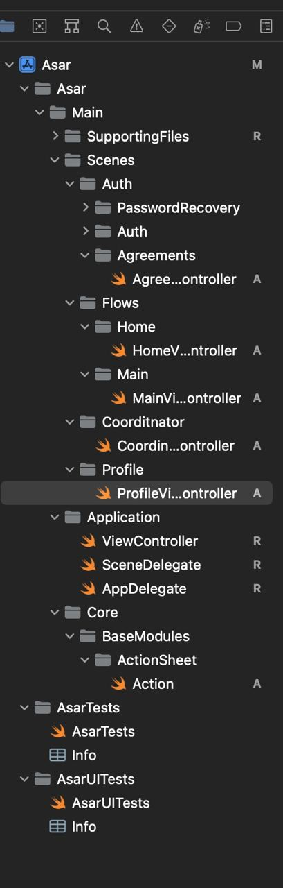

# Azamat Meirkhan
* Made meeting to share status of each team member and their plans (by the following link ...)

* Planed the following tasks of our team in Trello platform https://trello.com/b/l1k8Zhnf/tasks

# Laila Mukhambetzhanova
There are pains of custumers: Many users are not satisfied with the fact that the interfaces of some applications are inconvenient, the fonts are small, the pictures are large, the icons are also small, and so on. When registering, there is a large number of forms to fill out, that is, users need to fill out or questionnaire to take a short time, preferably a couple of forms. And also, in many applications, they are obliged to turn on notifications (“Домовенок - уборка, мойка окон”) and issue paid subscriptions in order to create more orders or services. (“YouDo: работа, курьеры, уборка”, “Naimi.kz”)
Users complained that there is no work with application users, that is, technical support and managers do not fulfill their duties and there is no feedback. (“Airo — сервис бытовых услуг”)

Also, the structure of applications by service users was also developed in Miro.
https://miro.com/app/board/uXjVOHhPJmY=/?invite_link_id=768927056766

# Khassenov Abylbek
Create 4 folders. Application: Start everything and run the application through the AppDelegate (default functions of any application)

Core: Data, UI components that will later be reused inside the application. For example, inside BaseModules we create an ActionSheet . This is the UI element for displaying the action selection notification.

Scenes: all screens and their logic. For example, the Auth folder contains the Auth , Agreements , PasswordRecovery folders.
 Auth - authentication screens, Agreements - screens for agreeing to data returns (sharing geodata), PasswordRecovery (screens for password recovery).

SupportingFiles: files to support the project, such as images and externally included frameworks

We also use a pattern called Coordinators to better manage the entire flow of the application.
https://www.hackingwithswift.com/articles/71/how-to-use-the-coordinator-pattern-in-ios-apps

# Nurpeiis Bexultan

Create a Swift files and Cocoa touch classes to given folders. Each folders were divided by thei functionality, data, UI, that's why it was given files by their types.
    
    * Swift File - a source of code in file.
    * Cocoa touch class - file that has frsameworks and foundations.

# Konys Aituar
Made more detailed analys to find needed points

