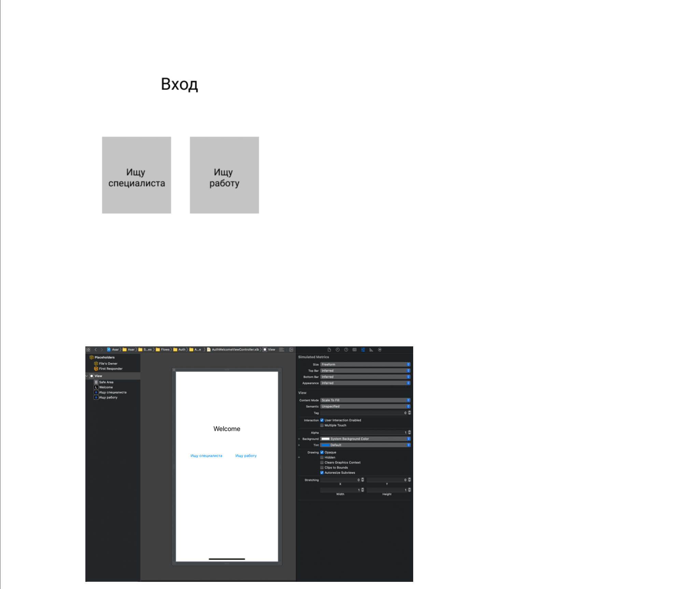

# Laila Mukhambetzhanova

With the help of websites, Behance, Dribble, Awwwards, a mood board was created.  I chose similar projects to our project and chose good cases for further work.  Using these examples, you can create your own application design. You can also see the solution of some problems. Therefore, a mood board is created.

https://www.behance.net/gallery/135014619/Home-Services-App?tracking_source=search_projects%7Chome%20service
https://www.behance.net/gallery/137804649/HOMEASY-Home-Services?tracking_source=search_projects%7Chome%20service
https://www.behance.net/gallery/99858941/Home-Service-Mobile-App?tracking_source=search_projects%7Chome%20service
https://dribbble.com/shots/15385853-Home-Service-App-I-Ofspace/attachments/7149492?mode=media

# Khassenov Abylbek

Added basic design elements of the welcome and authorization page for further work. Transitions for authorization flow are configured, which consists of 1. Authorization screen (AuthViewController)
2. Password recovery screen (RecoveryPasswordViewController)
3. Welcome Screen (AuthWelcomeViewController)

If we consider in detail what was used and will be used in the future, then we used the environment built into xcode to create view xib files. UILabel is the base object for displaying texts. The texts here are default, since it will be configured through the code with the addition
of a language selection. UITextFied - An input field that has a placeholder whose text is also default. UIButton - a button to click after which the transition to another flow.

# Azamat Meirkhan
I analyzed working processes of the team and realized that we have to spend more time on creating database and configure user flow by the developers, and the design of our application. It's our priority for future.

# Konys Aituar
Learned and chose righ A/B test for our project.