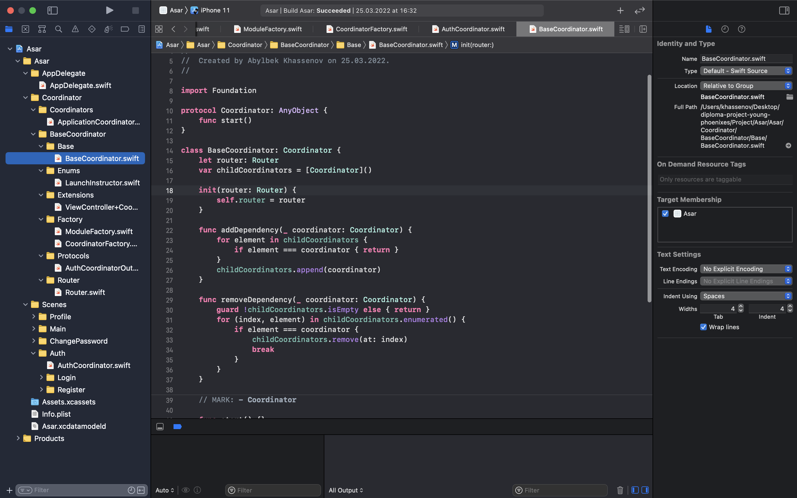
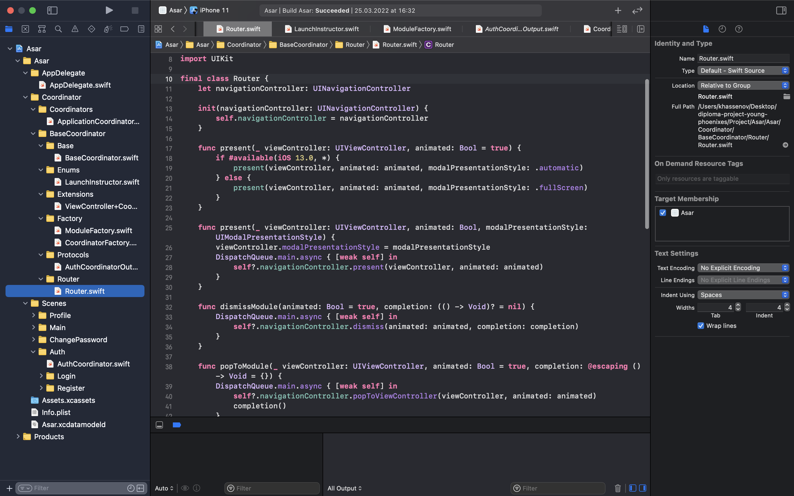
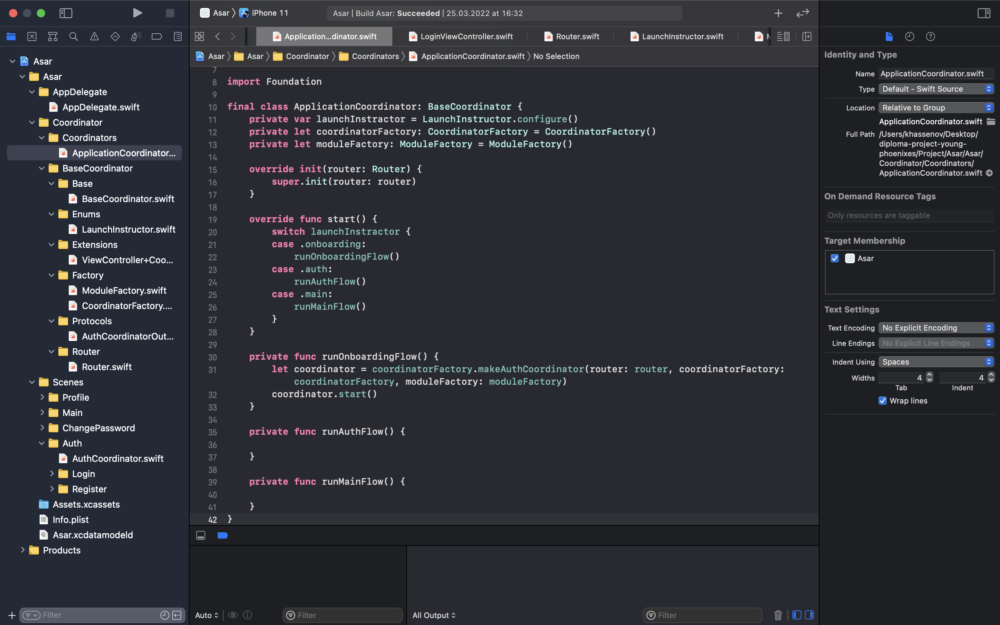
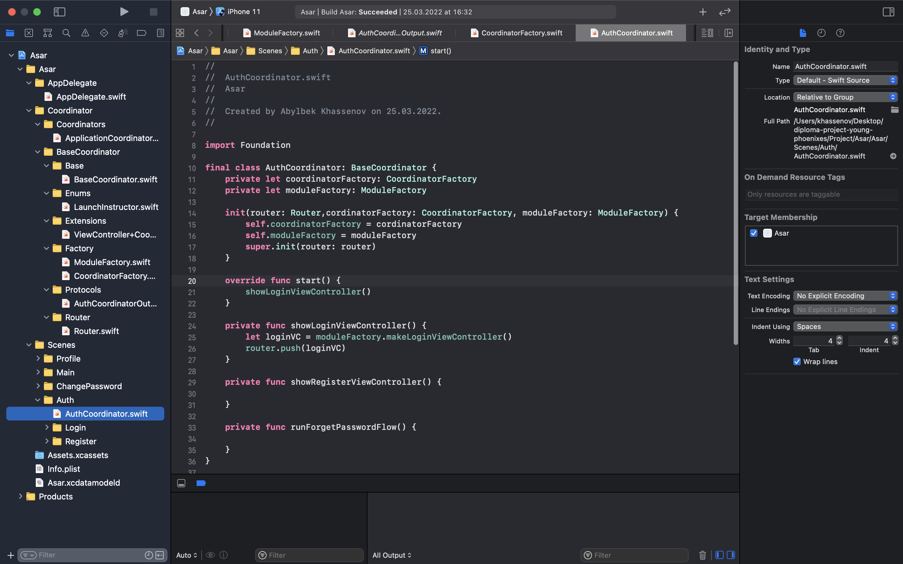
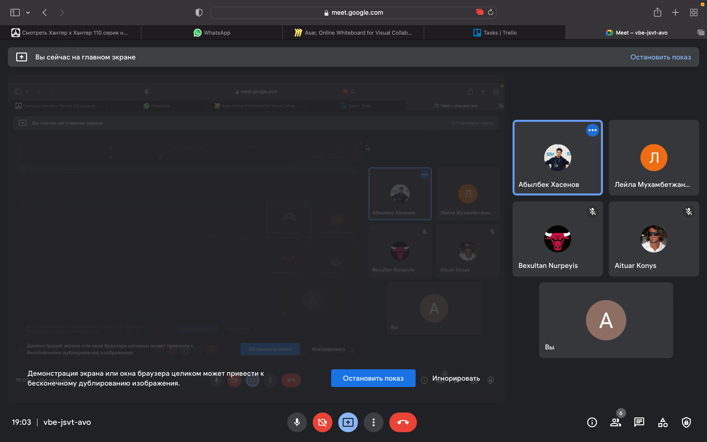
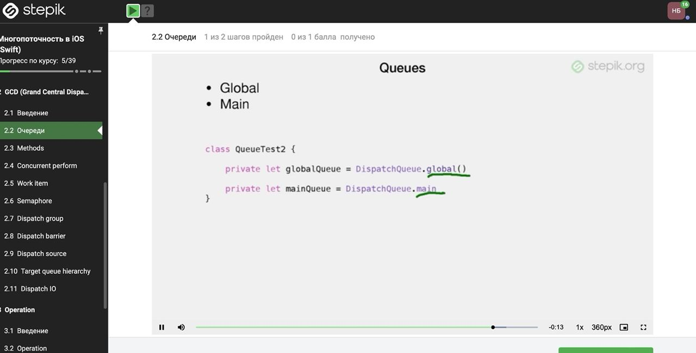
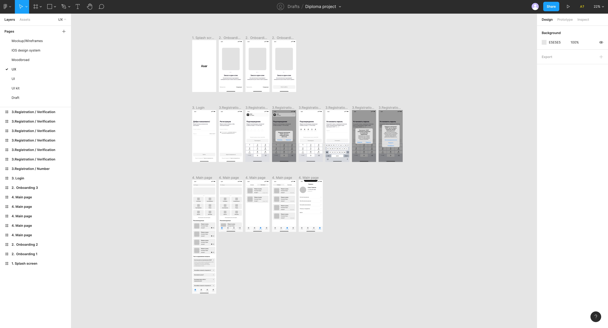

# Khassenov Abylbek 
According to the plan for week 9 create segues between screened and configure user flow , since we use coordinators for transitions between screens, I created baseCoordinator whose function to add and remove dependencies also has a variable router.

Router contains all the necessary transitions between screens, it is the router that we will use in the future for this. All functions that router contains

present(_ viewController: UIViewController, animated: Bool = true)
 
present(_ viewController: UIViewController, animated: Bool, modalPresentationStyle: UIModalPresentationStyle)

dismissModule(animated: Bool = true, completion: (() -> Void)? = nil)

popToModule(_ viewController: UIViewController, animated: Bool = true, completion: @escaping () -> Void = {})

push(_ viewController: UIViewController, animated: Bool = true, hideBottomBarWhenPushed: Bool = true)

popModule(animated: Bool = true)

setRootModule(_ viewController: UIViewController, isNavigationBarHidden: Bool = false)

popToRootModule(animated: Bool = true, completion: @escaping () -> Void = {})

The role of these functions should be clear from the names.

ApplicationCoorinator is our first coordinator to open. This is an example of how all coordinators will work in the future, and each coordinator will inherit baseCoordinator to have a router , either to pass to another coordinator or to use the function as intended.

An example of the above. We create an AuthCoordinator that can open the login, registration and password recovery screen. Here we already use the router not to transfer to another coordinator , but to open one of the screens depending on the button that the user will press.

# Meirkhan Azamat

I made meeting with team members and went through tasks. So, and made some question for customers in google form https://docs.google.com/forms/d/e/1FAIpQLSc1amNO97orCjl81LSO5E4r8sxPR_LvME-dxhYdwRJT6hVHVg/viewform?usp=sf_link. Next week i will share this link to the future users to take feedback.

# Nurpeiis Bexultan
I started to learn multithreading in open platform named Stepik. I learned, how to easily use GCD(Grand Central Dispatch). 

# Laila Mukhambetzhanova
Work on the UX design has been started. I drew the onboarding pages, login and registration pages, and also developed the main pages, like home page, my orders and profile. The onboarding page helps the user to assimilate the application faster, that is, it explains how the mobile app works. We will have 3 such pages. Then after the onboarding pages, registration and login pages come out. If the user has just started using the application, then first user register and see the main page. 
